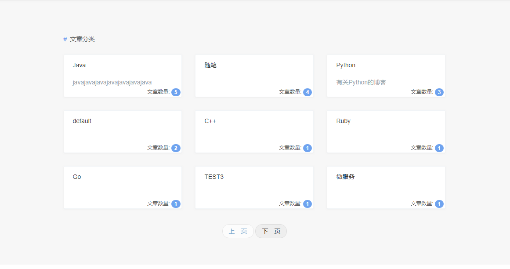
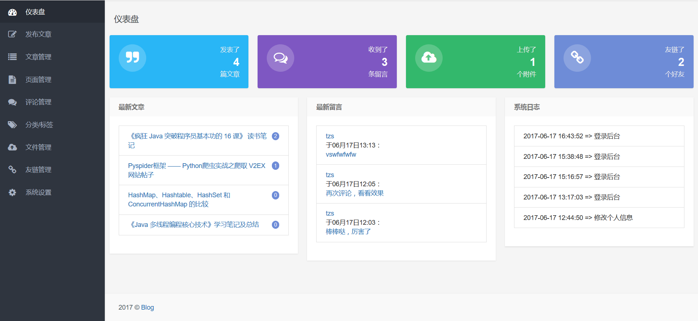

## arongblog

fork from [My-Blog](https://github.com/ZHENFENG13/My-Blog) , 并且在原先的基础上进行了一些修改：
1、使用gradle重新构建项目
2、新增欢迎页
3、修改‘归档’栏目为‘时间轴’栏目
4、新增‘文章分类’栏目
5、修改项目相关bug

 

## 功能如下：
 
 [新增]欢迎页：
 

 
 [修改]博客首页：
 
 
 
 [修改]时间轴：
 

 [新增]文章分类：
 
 
 搜索：
 
 
 **后台管理**
 
 管理登录：
 
 
 管理首页：
 
 
 发布文章：
 
 
 文章管理：
 
 
 页面管理：
 
 
 分类标签：
 
 
 文件管理：
 
   
 系统设置：
 
 
## 开源协议

[MIT](./LICENSE)

## 感谢

[ZHENFENG13](https://github.com/ZHENFENG13)
[otale](https://github.com/otale)
